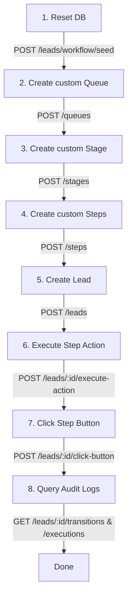

# CRM Workflow Automation: API Documentation & Integration Guide

Welcome to the API Documentation for the CRM Workflow Automation backend! This guide will help frontend developers understand how to configure, query, and integrate the CRM pipeline and lead management system.

> [!TIP]
> **Interactive Swagger Playgrounds**: An interactive Swagger UI is available at `http://localhost:3000/api` when the server is running. You can use it to test requests and responses directly from your browser.

---

## 🌟 High-Level Architecture Overview

The system operates on a hierarchical workflow structure:
1. **Queues**: High-level pipelines (e.g., *New Customers*, *Renewals*, *Cancellations*).
2. **Stages**: Columns/stages within a Queue (e.g., *Qualification*, *Engagement*, *Proposal*).
3. **Steps**: Specific action tasks within a Stage (e.g., *Introduction*, *Requirement Form*).
   - Each Step is bound to a specific **StepActionType** (like sending email with buttons, calendar invites, or form links).
   - A Step can have **StepActionContent** (subject, body, attachments, metadata) and **StepButtons**.
4. **Buttons & Transitions**: Buttons associated with a Step have configured transitions (**TransitionTargetType**) that define where a Lead is routed when that button is clicked (e.g., next step, next stage, different queue, convert to customer, or do nothing).

---

## 🗺️ Developer Integration Workflow (Step-by-Step)

## 🗺️ Developer Integration Workflow (Step-by-Step)

If you are new to the project or integrating a new frontend interface, follow this dynamic workflow to test and integrate the APIs:



### Step 1: Clean the Workspace (Reset Database)
Wipe out any existing data to start with a fresh environment.
- **Endpoint**: `POST /leads/workflow/seed`
- **What it does**: Clears all tables in the database (leads, customers, queues, stages, steps, buttons, transitions).
- **Why**: Gives the frontend a clean state to build customized workflows from scratch.

### Step 2: Create a Queue
Create a high-level pipeline funnel from the frontend interface.
- **Endpoint**: `POST /queues`
- **What it does**: Registers a new pipeline (e.g., `"Sales Funnel"`).
- **Response**: Returns the created Queue object containing a `queueId`.

### Step 3: Create a Stage
Define the columns/stages belonging to your Queue.
- **Endpoint**: `POST /stages`
- **What it does**: Registers a stage column inside a queue (e.g., `"Initial Inquiry"` under `"Sales Funnel"`).
- **Response**: Returns the Stage object containing a `stageId`.

### Step 4: Create Steps (Select from Available Action Types)
Define the sequential steps inside a stage and choose what automatic task it carries out.
- **Endpoint**: `POST /steps`
- **What it does**: Adds a step to the stage (e.g., `"Welcome Contact"`). You must choose the automation type from the available `StepActionType` list (e.g., `send_email_with_buttons` or `send_sms`).
- **Response**: Returns the Step object containing a `stepId`.
- **Note**: You can also add buttons to this step via `POST /steps/:id/buttons` and map transition targets using `POST /steps/buttons/:buttonId/transitions`.

### Step 5: Create a Lead
Introduce a contact into your custom workflow.
- **Endpoint**: `POST /leads`
- **What it does**: Adds a lead. If you don't supply explicit `currentQueueId`, `currentStageId`, and `currentStepId` fields in the body, the lead is automatically placed at the first step of the first stage of the first active queue you created.
- **Response**: Returns the created Lead object.
- **Why**: Leads cannot be created unless at least one Queue, Stage, and Step exist in the system (otherwise the server will return a `400 Bad Request` error: `"No active queues configured in the system. Please create a queue, stage, and step first."`).

### Step 6: Execute the Step's Action
Trigger the automated task associated with the lead's current step.
- **Endpoint**: `POST /leads/:id/execute-action`
- **What it does**: Dispatches the communication configured on the lead's current step (e.g., logs a dispatched email or SMS).
- **Result**: Creates a record in the execution log history (`status: "sent"`).

### Step 7: Simulate a Lead Clicking a Button
Trigger the transition configuration associated with a step button.
- **Endpoint**: `POST /leads/:id/click-button` (Body: `{ "buttonId": "..." }`)
- **What it does**: Simulates a customer clicking a button in their email (like *"Yes, let's proceed"* or *"Sign Contract"*).
- **Result**: Moves the lead automatically based on the transition rules (e.g., moves them to the next step, next stage, or converts them to a customer).

### Step 8: Query Lead Logs & Transitions
Verify that lead movements are correctly tracked.
- **Endpoints**: `GET /leads/:id/transitions` and `GET /leads/:id/executions`
- **What they do**: Provide a full audit trail of where a lead has been, what buttons they clicked, and what step actions were executed.

---

## 🛠️ Complete API Reference

All requests must have their headers set to `Content-Type: application/json` unless otherwise specified.

### 📋 Table of Contents
- [Authentication APIs](#-authentication-apis)
- [Workspaces APIs](#-workspaces-apis)
- [Workflow & Configuration APIs](#-workflow--configuration-apis)
- [Leads & Customers APIs](#-leads--customers-apis)
- [Queues APIs](#-queues-apis)
- [Stages APIs](#-stages-apis)
- [Steps & Buttons APIs](#-steps--buttons-apis)
- [Forms APIs](#-forms-apis)
- [Storage & Upload APIs](#-storage--upload-apis)
- [Notifications & Email APIs](#-notifications--email-apis)

---

### 🔐 Authentication APIs

#### 1. Register User
*Registers a new user/staff account and automatically provisions their default workspace.*
- **Method**: `POST`
- **Path**: `/auth/register`
- **Body**:
  ```json
  {
    "email": "staff@example.com",
    "password": "Password123!",
    "workspace": "Airnet Data Pty Ltd"
  }
  ```
- **Response (`201 Created`)**:
  ```json
  {
    "id": "user-uuid",
    "email": "staff@example.com",
    "workspace": "Airnet Data Pty Ltd",
    "createdAt": "2026-07-31T07:16:45.000Z",
    "updatedAt": "2026-07-31T07:16:45.000Z"
  }
  ```

#### 2. User Login
*Authenticate user email and password. Returns access and refresh tokens containing the active workspaceId and workspaceName.*
- **Method**: `POST`
- **Path**: `/auth/login`
- **Body**:
  ```json
  {
    "email": "staff@example.com",
    "password": "Password123!"
  }
  ```
- **Response (`200 OK`)**:
  ```json
  {
    "accessToken": "eyJhbGciOiJIUzI1...",
    "refreshToken": "eyJhbGciOiJIUzI1...",
    "user": {
      "id": "user-uuid",
      "email": "staff@example.com",
      "workspaceId": "workspace-uuid",
      "workspaceName": "Airnet Data Pty Ltd"
    }
  }
  ```

#### 3. Switch Workspace
*Allows a user to switch their active workspace context and returns a new set of access/refresh tokens.*
- **Method**: `POST`
- **Path**: `/auth/switch-workspace`
- **Headers**: `Authorization: Bearer <jwt-token>`
- **Body**:
  ```json
  {
    "workspaceId": "target-workspace-uuid"
  }
  ```
- **Response (`200 OK`)**:
  ```json
  {
    "accessToken": "eyJhbGciOiJIUzI1...",
    "refreshToken": "eyJhbGciOiJIUzI1..."
  }
  ```

#### 4. Refresh Access Token
*Refresh expired JWT access tokens.*
- **Method**: `POST`
- **Path**: `/auth/refresh`
- **Body**:
  ```json
  {
    "refreshToken": "eyJhbGciOiJIUzI1..."
  }
  ```
- **Response (`200 OK`)**:
  ```json
  {
    "accessToken": "eyJhbGciOiJIUzI1...",
    "refreshToken": "eyJhbGciOiJIUzI1..."
  }
  ```

#### 5. User Signout
*Sign out the currently authenticated user.*
- **Method**: `POST`
- **Path**: `/auth/signout`
- **Headers**: `Authorization: Bearer <jwt-token>`
- **Response (`200 OK`)**:
  ```json
  {
    "message": "Logged out successfully"
  }
  ```

#### 6. Get User Profile
*Fetch the profile details of the currently logged-in user.*
- **Method**: `GET`
- **Path**: `/users/me`
- **Headers**: `Authorization: Bearer <jwt-token>`
- **Response (`200 OK`)**:
  ```json
  {
    "id": "user-uuid",
    "email": "staff@example.com",
    "workspace": "Airnet Data Pty Ltd",
    "firstName": "John",
    "lastName": "Doe",
    "createdAt": "2026-07-31T07:16:45.000Z",
    "updatedAt": "2026-07-31T07:16:45.000Z"
  }
  ```

#### 7. Update User Profile
*Update the profile/credentials of the currently logged-in user.*
- **Method**: `PATCH`
- **Path**: `/users/me`
- **Headers**: `Authorization: Bearer <jwt-token>`
- **Body** (optional):
  ```json
  {
    "firstName": "John",
    "lastName": "Doe",
    "email": "john.doe@example.com",
    "password": "NewPassword123!"
  }
  ```
- **Response (`200 OK`)**: Updated User profile object.

---

### 🏢 Workspaces APIs

Workspaces partition and isolate CRM pipelines, stages, steps, leads, and customer data.

#### 1. Create Workspace
- **Method**: `POST`
- **Path**: `/workspaces`
- **Headers**: `Authorization: Bearer <jwt-token>`
- **Body**:
  ```json
  {
    "name": "Acme Corp Branch",
    "orgName": "Acme Corp Ltd",
    "logoUrl": "https://example.com/logo.png"
  }
  ```
- **Response (`21 Created`)**:
  ```json
  {
    "id": "workspace-uuid",
    "name": "Acme Corp Branch",
    "orgName": "Acme Corp Ltd",
    "logoUrl": "https://example.com/logo.png",
    "userId": "user-uuid"
  }
  ```

#### 2. Get All User Workspaces
- **Method**: `GET`
- **Path**: `/workspaces`
- **Headers**: `Authorization: Bearer <jwt-token>`
- **Response (`200 OK`)**: Array of Workspace objects.

#### 3. Update Workspace Details
- **Method**: `PUT`
- **Path**: `/workspaces/:id`
- **Headers**: `Authorization: Bearer <jwt-token>`
- **Body**: Same as Create (all fields optional).

#### 4. Upload Company Logo
*Uploads a workspace brand logo file directly to S3/Spaces storage and links it to the workspace logoUrl.*
- **Method**: `POST`
- **Path**: `/workspaces/:id/logo`
- **Headers**: `Authorization: Bearer <jwt-token>`, `Content-Type: multipart/form-data`
- **Body**: Multipart file under key `file`.
- **Response (`200 OK`)**: Updated Workspace object containing the new `logoUrl`.

---

### 🔄 Workflow & Configuration APIs

#### 1. Reset Database / Clear Workflows
*Wipe the database to prepare for a clean, custom workflow layout.*
- **Method**: `POST`
- **Path**: `/leads/workflow/seed`
- **Response (`200 OK`)**:
  ```json
  {
    "message": "Database reset successfully. Ready for custom workflow configuration.",
    "workflowSummary": {
      "queues": [],
      "stages": [],
      "steps": []
    }
  }
  ```

#### 2. Get Full Active Workflow Hierarchy
*Get all pipelines, stages, steps, action content, and button configurations in one tree.*
- **Method**: `GET`
- **Path**: `/leads/workflow/queues`
- **Response (`200 OK`)**:
  ```json
  [
    {
      "id": "queue-uuid",
      "name": "New Customers",
      "description": "Pipeline for onboarding prospective clients",
      "isActive": true,
      "stages": [
        {
          "id": "stage-uuid",
          "name": "Qualification",
          "orderIndex": 1,
          "steps": [
            {
              "id": "step-uuid",
              "name": "Introduction",
              "actionType": "send_email_with_buttons",
              "actionContent": {
                "id": "content-uuid",
                "subject": "Welcome to Airnet!",
                "body": "Hi there, are you ready to unlock our advanced CRM services?",
                "attachmentUrl": null,
                "videoUrl": null,
                "metadata": {}
              },
              "buttons": [
                {
                  "id": "button-uuid-yes",
                  "label": "Yes, let's proceed",
                  "transition": {
                    "id": "trans-uuid",
                    "targetType": "next_step",
                    "targetStepId": null,
                    "targetStageId": null,
                    "targetQueueId": null
                  }
                }
              ]
            }
          ]
        }
      ]
    }
  ]
  ```

---

### 👤 Leads & Customers APIs

#### 1. Create a Lead
- **Method**: `POST`
- **Path**: `/leads`
- **Body**:
  ```json
  {
    "firstName": "John",
    "lastName": "Doe",
    "email": "john.doe@example.com",
    "phoneNumber": "+1234567890",
    "sendEmail": true,
    "sendSms": true,
    "sendWhatsapp": false,
    "currentQueueId": "queue-uuid-opt",
    "currentStageId": "stage-uuid-opt",
    "currentStepId": "step-uuid-opt"
  }
  ```
- **Response (`201 Created`)**:
  ```json
  {
    "id": "lead-uuid",
    "firstName": "John",
    "lastName": "Doe",
    "email": "john.doe@example.com",
    "phoneNumber": "+1234567890",
    "currentQueueId": "queue-uuid",
    "currentStageId": "stage-uuid",
    "currentStepId": "step-uuid",
    "status": "active",
    "createdAt": "2026-07-23T07:51:30.000Z",
    "updatedAt": "2026-07-23T07:51:30.000Z"
  }
  ```

#### 2. Public Lead Registration (FormBuilder)
*Unauthenticated public endpoint representing custom website forms (leaves the lead unallocated).*
- **Method**: `POST`
- **Path**: `/leads/public-register`
- **Body**:
  ```json
  {
    "firstName": "Alice",
    "lastName": "Smith",
    "email": "alice.smith@example.com",
    "phoneNumber": "+1555019988"
  }
  ```
- **Response (`201 Created`)**:
  ```json
  {
    "id": "lead-uuid",
    "firstName": "Alice",
    "lastName": "Smith",
    "email": "alice.smith@example.com",
    "phoneNumber": "+1555019988",
    "currentQueueId": null,
    "currentStageId": null,
    "currentStepId": null,
    "status": "active",
    "createdAt": "2026-08-04T10:00:00.000Z",
    "updatedAt": "2026-08-04T10:00:00.000Z"
  }
  ```

#### 3. Get All Leads (with dynamic filters, search, sort, and pagination)
- **Method**: `GET`
- **Path**: `/leads`
- **Headers**: `Authorization: Bearer <jwt-token>`
- **Query Parameters** (optional):
  - `status`: Filter by lead status (`active`, `converted`, `lost`)
  - `queueId`: Filter by current Queue UUID
  - `stageId`: Filter by current Stage UUID
  - `stepId`: Filter by current Step UUID
  - `allocation`: Filter by allocation status (`allocated` to return leads in a queue, `unallocated` to return leads from public forms, `all` to return both)
  - `page`: Page number for pagination (default: `1`)
  - `limit`: Page limit size (default: `50`)
  - `search`: Global search string on lead name, suburb, or postcode
  - `sortBy`: Sort field (e.g., `date`, `createdAt`)
  - `sortOrder`: Sort order (`ASC`, `DESC` - defaults to `DESC`)
  - `startDate`: Filter leads created on or after date (e.g., `2026-08-01`)
  - `endDate`: Filter leads created on or before date (e.g., `2026-08-10`)
- **Response (`200 OK`)**: Array of Lead objects.

#### 4. Get Lead Details
- **Method**: `GET`
- **Path**: `/leads/:id`
- **Response (`200 OK`)**:
  ```json
  {
    "id": "lead-uuid",
    "firstName": "John",
    "lastName": "Doe",
    "email": "john.doe@example.com",
    "phoneNumber": "+1234567890",
    "status": "active",
    "currentQueue": { "id": "...", "name": "..." },
    "currentStage": { "id": "...", "name": "..." },
    "currentStep": { "id": "...", "name": "..." }
  }
  ```

#### 5. Execute Step Action
*Triggers the automated task configured for the lead's current step. Supports optionally filtering which buttons are sent in the email, and passing custom regards content.*
- **Method**: `POST`
- **Path**: `/leads/:id/execute-action`
- **Body** (optional):
  ```json
  {
    "buttonIds": [
      "button-uuid-1",
      "button-uuid-2"
    ],
    "regards": "Regards\nJohn Doe\nWorkspace Name"
  }
  ```
- **Response (`200 OK`)**:
  ```json
  {
    "id": "execution-uuid",
    "leadId": "lead-uuid",
    "stepId": "step-uuid",
    "actionType": "send_email_with_buttons",
    "status": "sent",
    "executedAt": "2026-07-23T07:53:00.000Z",
    "createdAt": "2026-07-23T07:53:00.000Z"
  }
  ```

#### 6. Click Button
*Simulates button click. This will execute transitions bound to the button.*
- **Method**: `POST`
- **Path**: `/leads/:id/click-button`
- **Body**:
  ```json
  {
    "buttonId": "button-uuid"
  }
  ```
- **Response (`200 OK`)**: Updated Lead object (reflecting new queue/stage/step routing).

#### 7. Move Lead Manually
- **Method**: `POST`
- **Path**: `/leads/:id/move`
- **Body**:
  ```json
  {
    "queueId": "queue-uuid-opt",
    "stageId": "stage-uuid-opt",
    "stepId": "step-uuid-opt"
  }
  ```
- **Response (`200 OK`)**: Updated Lead object.

#### 8. Convert Lead to Customer
- **Method**: `POST`
- **Path**: `/leads/:id/convert`
- **Body**:
  ```json
  {
    "accountManagerId": "manager-uuid-opt",
    "contractStartDate": "2026-08-01"
  }
  ```
- **Response (`200 OK`)**:
  ```json
  {
    "id": "customer-uuid",
    "convertedFromLeadId": "lead-uuid",
    "firstName": "John",
    "lastName": "Doe",
    "email": "john.doe@example.com",
    "phone": "+1234567890",
    "status": "active",
    "accountManagerId": "manager-uuid",
    "contractStartDate": "2026-08-01",
    "convertedAt": "2026-07-23T07:54:00.000Z",
    "createdAt": "2026-07-23T07:54:00.000Z",
    "updatedAt": "2026-07-23T07:54:00.000Z"
  }
  ```

#### 9. Get Converted Customers (with pagination, search, sort, and filtering)
*Retrieves all active customer records in the active workspace. Default sorting places newly converted customers first.*
- **Method**: `GET`
- **Path**: `/leads/customers`
- **Headers**: `Authorization: Bearer <jwt-token>`
- **Query Parameters** (optional):
  - `status`: Filter by customer status
  - `queueId`: Filter by current Queue UUID
  - `stageId`: Filter by current Stage UUID
  - `stepId`: Filter by current Step UUID
  - `page`: Page number for pagination (default: `1`)
  - `limit`: Page limit size (default: `50`)
  - `search`: Global search string on customer name, email, or phone
  - `sortBy`: Sort field (e.g., `convertedAt`, `createdAt`, `updatedAt`, `firstName`, `lastName`, `contractStartDate` - default: `convertedAt`)
  - `sortOrder`: Sort order (`ASC`, `DESC` - default: `DESC`)
  - `startDate`: Filter customers converted on or after date (e.g., `2026-08-01`)
  - `endDate`: Filter customers converted on or before date (e.g., `2026-08-10`)
- **Response (`200 OK`)**: Array of Customer objects.

#### 10. Get Customer Details
*Retrieves the profile details of a converted customer.*
- **Method**: `GET`
- **Path**: `/leads/customers/:id`
- **Headers**: `Authorization: Bearer <jwt-token>`
- **Response (`200 OK`)**:
  ```json
  {
    "id": "customer-uuid",
    "convertedFromLeadId": "lead-uuid",
    "firstName": "Jane",
    "lastName": "Doe",
    "email": "jane.doe@example.com",
    "phone": "+1234567890",
    "currentQueueId": "queue-uuid",
    "currentStageId": "stage-uuid",
    "currentStepId": "step-uuid",
    "accountManagerId": "manager-uuid",
    "contractStartDate": "2026-08-01",
    "status": "active",
    "convertedAt": "2026-07-23T07:54:00.000Z",
    "createdAt": "2026-07-23T07:54:00.000Z",
    "updatedAt": "2026-07-23T07:54:00.000Z"
  }
  ```

#### 11. Update Customer Details
*Update details of a converted customer.*
- **Method**: `PATCH`
- **Path**: `/leads/customers/:id`
- **Headers**: `Authorization: Bearer <jwt-token>`
- **Body** (optional):
  ```json
  {
    "firstName": "JaneChanged",
    "status": "inactive"
  }
  ```
- **Response (`200 OK`)**: Updated Customer object.

#### 12. Get Lead Transition Log
*Retrieves all history of pipeline moves for this Lead.*
- **Method**: `GET`
- **Path**: `/leads/:id/transitions`
- **Response (`200 OK`)**: Array of `ContactTransitionLog` entries.

#### 13. Get Lead Execution Log
*Retrieves all history of automated step actions triggered for this Lead.*
- **Method**: `GET`
- **Path**: `/leads/:id/executions`
- **Response (`200 OK`)**: Array of `StepActionExecution` entries.

#### 14. Get Raw Lead Data
*Retrieves the raw Lead database record.*
- **Method**: `GET`
- **Path**: `/leads/:id/raw`
- **Headers**: `Authorization: Bearer <jwt-token>`
- **Response (`200 OK`)**:
  ```json
  {
    "id": "lead-uuid",
    "firstName": "John",
    "lastName": "Doe",
    "email": "john.doe@example.com",
    "phoneNumber": "+1234567890",
    "suburb": "Surry Hills",
    "postcode": "2010",
    "state": "NSW",
    "status": "active",
    "currentQueueId": "queue-uuid",
    "currentStageId": "stage-uuid",
    "currentStepId": "step-uuid",
    "notes": "Follow up call scheduled",
    "attachments": ["https://example.com/contract.pdf"],
    "createdAt": "2026-07-23T07:51:30.000Z",
    "updatedAt": "2026-07-23T07:51:30.000Z"
  }
  ```

#### 15. Update Specific Lead Details
*Update properties of a specific lead.*
- **Method**: `PATCH`
- **Path**: `/leads/:id`
- **Headers**: `Authorization: Bearer <jwt-token>`
- **Body** (optional):
  ```json
  {
    "firstName": "Alice",
    "lastName": "Smith",
    "email": "alice.smith@example.com",
    "phoneNumber": "+1555019988",
    "suburb": "Surry Hills",
    "postcode": "2010",
    "state": "NSW",
    "status": "active",
    "notes": "Follow up call scheduled",
    "attachments": ["https://example.com/contract.pdf"]
  }
  ```
- **Response (`200 OK`)**: Updated Lead object.

#### 16. Upload Lead Attachment
*Uploads a file directly to DigitalOcean Spaces/S3 storage and associates/links it to the specified lead's attachments list.*
- **Method**: `POST`
- **Path**: `/leads/:id/attachments`
- **Headers**: `Authorization: Bearer <jwt-token>`, `Content-Type: multipart/form-data`
- **Body**: Multipart file under key `file`.
- **Response (`201 Created`)**: Updated Lead object with the new attachment appended:
  ```json
  {
    "id": "lead-uuid",
    "firstName": "John",
    "lastName": "Doe",
    "email": "john.doe@example.com",
    "phoneNumber": "+1234567890",
    "suburb": "Surry Hills",
    "postcode": "2010",
    "state": "NSW",
    "status": "active",
    "currentQueueId": "queue-uuid",
    "currentStageId": "stage-uuid",
    "currentStepId": "step-uuid",
    "notes": "Follow up call scheduled",
    "attachments": [
      {
        "name": "contract.pdf",
        "url": "https://do-spaces-bucket.do-spaces-endpoint/attachments/contract.pdf",
        "size": 1024,
        "uploadedAt": "2026-08-17T14:10:00.000Z"
      }
    ],
    "createdAt": "2026-07-23T07:51:30.000Z",
    "updatedAt": "2026-08-17T14:10:00.000Z"
  }
  ```

#### 17. Get Dashboard Analytics & Statistics
*Retrieves visual dashboard metrics (Total Leads, New Leads %, Avg Conversion %, Target %, line chart points) along with the active workspace name and logo URL dynamically computed from DB records.*
- **Method**: `GET`
- **Path**: `/leads/dashboard/stats`
- **Headers**: `Authorization: Bearer <jwt-token>`
- **Query Parameters** (optional):
  - `startDate`: Filter stats starting from date (e.g. `2026-08-01`)
  - `endDate`: Filter stats up to date (e.g. `2026-08-10`)
- **Response (`200 OK`)**:
  ```json
  {
    "totalLeads": {
      "value": 2,
      "changePercentage": 0,
      "trend": "up"
    },
    "newLeads": {
      "value": 100,
      "changePercentage": 0,
      "trend": "up"
    },
    "avgConversion": {
      "value": 0,
      "changePercentage": 0,
      "trend": "up"
    },
    "quarterlyTarget": {
      "target": 10,
      "current": 0,
      "percentage": 0
    },
    "chartData": [
      { "date": "Jul 24", "leads": 2, "comparison": 0 }
    ],
    "workspaceName": "Airnet Data Pty Ltd",
    "workspaceLogo": "https://example.com/logo.png"
  }
  ```

#### 18. Allocate Leads to Queue/Stage
*Allocate unallocated leads (e.g., from public forms) to a specific Queue and Stage. Supports single-target bulk allocations (by count or leadIds) as well as multi-target batch allocations (specifying different queues and stages per lead).*
- **Method**: `POST`
- **Path**: `/leads/allocate`
- **Headers**: `Authorization: Bearer <jwt-token>`
- **Body** (optional):
  *Option A: Batch allocations to different stages/queues:*
  ```json
  {
    "allocations": [
      {
        "leadId": "lead-uuid-1",
        "queueId": "queue-uuid-1",
        "stageId": "stage-uuid-1"
      },
      {
        "leadId": "lead-uuid-2",
        "queueId": "queue-uuid-2",
        "stageId": "stage-uuid-2"
      }
    ]
  }
  ```
  *Option B: Single-target allocations:*
  ```json
  {
    "queueId": "queue-uuid-optional",
    "stageId": "stage-uuid-optional",
    "count": 5,
    "leadIds": [
      "lead-uuid-1",
      "lead-uuid-2"
    ]
  }
  ```
- **Response (`200 OK`)**: Array of allocated Lead objects.

---

### 📋 Queues APIs

#### 1. Create a Queue
- **Method**: `POST`
- **Path**: `/queues`
- **Body**:
  ```json
  {
    "name": "Enterprise Inquiries",
    "description": "Custom workflow for deals worth > $50k",
    "isActive": true
  }
  ```
- **Response (`201 Created`)**: Queue object.

#### 2. Get All Queues
- **Method**: `GET`
- **Path**: `/queues`
- **Response (`200 OK`)**: Array of Queue objects.

#### 3. Get Specific Queue
- **Method**: `GET`
- **Path**: `/queues/:id`

#### 4. Update Queue
- **Method**: `PUT`
- **Path**: `/queues/:id`
- **Body**: Same as Create (all fields optional).

#### 5. Delete Queue
- **Method**: `DELETE`
- **Path**: `/queues/:id`
- **Response (`204 No Content`)**

---

### 🔀 Stages APIs

#### 1. Create a Stage
- **Method**: `POST`
- **Path**: `/stages`
- **Body**:
  ```json
  {
    "queueId": "queue-uuid",
    "name": "Nurturing",
    "orderIndex": 4
  }
  ```
- **Response (`201 Created`)**: Stage object.

#### 2. Get All Stages
- **Method**: `GET`
- **Path**: `/stages`

#### 3. Get Stages for a specific Queue
- **Method**: `GET`
- **Path**: `/stages/queue/:queueId`

#### 4. Update Stage
- **Method**: `PUT`
- **Path**: `/stages/:id`
- **Body**: `{ "name": "Updated Name", "orderIndex": 2 }` (optional fields)

#### 5. Delete Stage
- **Method**: `DELETE`
- **Path**: `/stages/:id`
- **Response (`204 No Content`)**

---

### 🎯 Steps & Buttons APIs

Steps represent sequential automated action nodes configured within a Stage. Multiple steps can be assigned to a stage, and they are completely stage-specific: updating a step's action configurations (e.g., email body, buttons, templates) remains isolated to the stage it belongs to. When a lead enters a stage (via manual move or allocation), the first step of that stage is automatically executed (e.g., sending emails/SMS).

#### 1. Create a Step
*Creates a step and associates it with a specific Stage.*
- **Method**: `POST`
- **Path**: `/steps`
- **Body**:
  ```json
  {
    "name": "Follow-up Call Scheduled",
    "orderIndex": 3,
    "actionType": "send_sms",
    "stageId": "stage-uuid",
    "actionContent": {
      "subject": "Reminder",
      "body": "Hi, this is a text reminder for our schedule."
    }
  }
  ```
- **Response (`201 Created`)**: Step object.

#### 2. Get All Steps
*Retrieve all steps in the database.*
- **Method**: `GET`
- **Path**: `/steps`
- **Response (`200 OK`)**: Array of Step objects.

#### 3. Get Specific Step (with Config & Buttons)
*Retrieve configuration details of a specific step. This endpoint automatically fetches and merges its actionContent and associated step buttons.*
- **Method**: `GET`
- **Path**: `/steps/:id`
- **Response (`200 OK`)**:
  ```json
  {
    "id": "step-uuid",
    "name": "Welcome Email (with Buttons)",
    "orderIndex": 0,
    "actionType": "send_email_with_buttons",
    "createdAt": "2026-07-31T09:00:00.000Z",
    "updatedAt": "2026-07-31T09:00:00.000Z",
    "actionContent": {
      "id": "content-uuid",
      "stepId": "step-uuid",
      "subject": "Welcome to our Service!",
      "body": "Hi, thank you for connecting with us. Click one of the options below to proceed.",
      "attachmentUrl": null,
      "videoUrl": null,
      "metadata": {}
    },
    "buttons": [
      {
        "id": "button-uuid-1",
        "stepId": "step-uuid",
        "label": "Interested",
        "orderIndex": 0
      }
    ]
  }
  ```

#### 4. Update a Step
*Modify step details.*
- **Method**: `PUT`
- **Path**: `/steps/:id`
- **Body** (all fields optional):
  ```json
  {
    "name": "Updated Step Name",
    "orderIndex": 1,
    "actionType": "send_email_with_buttons",
    "actionContent": {
      "subject": "New Subject Line",
      "body": "New Body text"
    }
  }
  ```
- **Response (`200 OK`)**: Updated Step object.

#### 6. Add Button to a Step
- **Method**: `POST`
- **Path**: `/steps/:id/buttons`
- **Body**:
  ```json
  {
    "label": "Confirm Booking",
    "orderIndex": 1
  }
  ```
- **Response (`201 Created`)**: Button object.

#### 7. Configure Transition for a Button
*Define what happens when a button is clicked.*
- **Method**: `POST`
- **Path**: `/steps/buttons/:buttonId/transitions`
- **Body**:
  ```json
  {
    "targetType": "specific_step",
    "targetStepId": "target-step-uuid",
    "targetStageId": "target-stage-uuid-opt",
    "targetQueueId": "target-queue-uuid-opt"
  }
  ```
- **Response (`201 Created`)**: Transition configuration object.

---

### 📝 Forms APIs

Allows dynamic creation, retrieval, and unauthenticated submission of custom web forms. All forms created by authenticated staff are isolated by workspace and include a public-facing URL under the `link` property.

#### 1. Create a Form Configuration
- **Method**: `POST`
- **Path**: `/forms`
- **Headers**: `Authorization: Bearer <jwt-token>`
- **Body**:
  ```json
  {
    "title": "Contact Us",
    "description": "Please enter your info below.",
    "fields": [
      { "name": "firstName", "label": "First Name", "type": "text", "required": true, "mapTo": "firstName" },
      { "name": "lastName", "label": "Last Name", "type": "text", "required": true, "mapTo": "lastName" },
      { "name": "email", "label": "Email Address", "type": "email", "required": true, "mapTo": "email" },
      { "name": "phoneNumber", "label": "Phone Number", "type": "text", "required": false, "mapTo": "phoneNumber" }
    ],
    "isActive": true,
    "purpose": "lead_creation"
  }
  ```
- **Response (`201 Created`)**: Form object containing `id` and `workspaceId`.

#### 2. Get All Active Forms
*Retrieves all forms created under the active workspace context. Automatically generates and appends the dynamic public submission URL under `link` using a secure JWT-encoded token.*
- **Method**: `GET`
- **Path**: `/forms`
- **Headers**: `Authorization: Bearer <jwt-token>`
- **Response (`200 OK`)**:
  ```json
  [
    {
      "id": "form-uuid",
      "title": "Contact Us",
      "description": "Please enter your info below.",
      "fields": [],
      "isActive": true,
      "purpose": "lead_creation",
      "link": "http://localhost:3000/pwa/eyJhbGciOiJIUzI1...",
      "workspaceId": "workspace-uuid"
    }
  ]
  ```

#### 3. Fetch Form Details via JWT Token (Public Endpoint)
*Unauthenticated fetch of form configuration by decoding a secure JWT form token. Returns the form layout and the optional context leadId.*
- **Method**: `GET`
- **Path**: `/forms/pwa/:token`
- **Response (`200 OK`)**:
  ```json
  {
    "form": {
      "id": "form-uuid",
      "title": "Contact Us",
      "description": "Please enter your info below.",
      "fields": [],
      "isActive": true,
      "purpose": "lead_creation",
      "workspaceId": "workspace-uuid"
    },
    "leadId": "lead-uuid-or-null"
  }
  ```

#### 4. Submit Form Answers (Public Endpoint)
*Unauthenticated submission representing external landing pages.*
- **Method**: `POST`
- **Path**: `/forms/public/:id/submit`
- **Body**:
  ```json
  {
    "answers": {
      "firstName": "George",
      "lastName": "Hanson",
      "email": "george.hanson@example.com",
      "phoneNumber": "+1888999777"
    }
  }
  ```
- **Response (`200 OK`)**: Form submission log record.

---

### 💾 Storage & Upload APIs

Integrates with DigitalOcean Spaces (S3-compatible bucket) for uploading assets like workspace company logos, step email brochures/documents, and product walkthrough videos.

#### 1. Upload File
*Accepts a file upload and returns its public access URL.*
- **Method**: `POST`
- **Path**: `/storage/upload`
- **Headers**: `Content-Type: multipart/form-data`
- **Body**: Multipart file binary under key `file`.
- **Response (`201 Created`)**:
  ```json
  {
    "url": "https://sales-genie.syd1.digitaloceanspaces.com/uploads/uuid-filename.jpg"
  }
  ```

---

### ✉️ Notifications & Email APIs

Provides support for sending custom notification emails through configured SMTP or SendGrid mail servers.

#### 1. Send Custom Email
*Sends a custom text or HTML email to a target recipient.*
- **Method**: `POST`
- **Path**: `/notifications/send-email`
- **Headers**: `Authorization: Bearer <jwt-token>`
- **Body**:
  ```json
  {
    "to": "client@example.com",
    "subject": "Project Proposal Update",
    "body": "Hello, here is the update regarding your project proposal."
  }
  ```
- **Response (`200 OK`)**:
  ```json
  {
    "success": true,
    "message": "Email sent successfully."
  }
  ```

---

## 📖 Reference Lists & Enums

### StepActionType (`actionType`)
- `send_email_with_buttons`
- `send_email_with_attachments`
- `send_email_with_video`
- `send_calendar_invite`
- `send_email_with_form`
- `send_agreement_for_signature`
- `send_sms`
- `go_to_next_step`
- `go_to_next_stage`
- `go_to_next_queue`
- `convert_to_customer`
- `do_nothing`

### TransitionTargetType (`targetType`)
- `next_step`
- `next_stage`
- `next_queue`
- `specific_step`
- `specific_stage`
- `specific_queue`
- `convert_to_customer`
- `do_nothing`

---

## 📋 Default Step Configuration Payloads Reference

This section provides the exact HTTP request bodies required to configure each of the default email/SMS workflow steps via the CRM API.

### 1. Welcome Email (with Buttons)
Sends a welcome email containing clickable options to transition or route the lead based on their response.

* **Endpoint**: `POST /steps`
* **Request Body**:
  ```json
  {
    "name": "Welcome Email (with Buttons)",
    "orderIndex": 0,
    "actionType": "send_email_with_buttons",
    "actionContent": {
      "subject": "Welcome to our Service!",
      "body": "Hi, thank you for connecting with us. Click one of the options below to proceed."
    }
  }
  ```

#### Subsequent Actions (Buttons & Transitions)
After creating the step, perform the following requests to add buttons and link their transition targets:

1. **Add "Interested" Button**:
   * **Endpoint**: `POST /steps/:stepId/buttons`
   * **Body**:
     ```json
     {
       "label": "Interested",
       "orderIndex": 0
     }
     ```
2. **Configure "Interested" Transition**:
   * **Endpoint**: `POST /steps/buttons/:buttonId/transitions`
   * **Body**:
     ```json
     {
       "targetType": "next_step"
     }
     ```
3. **Add "Not Interested" Button**:
   * **Endpoint**: `POST /steps/:stepId/buttons`
   * **Body**:
     ```json
     {
       "label": "Not Interested",
       "orderIndex": 1
     }
     ```
4. **Configure "Not Interested" Transition**:
   * **Endpoint**: `POST /steps/buttons/:buttonId/transitions`
   * **Body**:
     ```json
     {
       "targetType": "do_nothing"
     }
     ```

---

### 2. Email with Product Brochure
Sends an email with a link or file attachment representing the product brochure.

* **Endpoint**: `POST /steps`
* **Request Body**:
  ```json
  {
    "name": "Email with Product Brochure",
    "orderIndex": 1,
    "actionType": "send_email_with_attachments",
    "actionContent": {
      "subject": "Here is your Product Brochure",
      "body": "Please find the attached brochure with details about our features, pricing, and services.",
      "attachmentUrl": "https://example.com/files/brochure.pdf"
    }
  }
  ```

---

### 3. Product Walkthrough Video Email
Sends an email containing an embedded or linked video walkthrough.

* **Endpoint**: `POST /steps`
* **Request Body**:
  ```json
  {
    "name": "Product Walkthrough Video Email",
    "orderIndex": 2,
    "actionType": "send_email_with_video",
    "actionContent": {
      "subject": "Watch our Product Walkthrough Video",
      "body": "Watch this quick video to see how our platform can help automate your workflow.",
      "videoUrl": "https://www.youtube.com/embed/dQw4w9WgXcQ"
    }
  }
  ```

---

### 4. Schedule Booking Calendar Invite
Sends an email containing a link for leads to schedule a booking or call.

* **Endpoint**: `POST /steps`
* **Request Body**:
  ```json
  {
    "name": "Schedule Booking Calendar Invite",
    "orderIndex": 3,
    "actionType": "send_calendar_invite",
    "actionContent": {
      "subject": "Let's Schedule a Quick Call",
      "body": "Please book a slot on our calendar to discuss details: https://calendly.com/your-team-booking"
    }
  }
  ```

---

### 5. Customer Feedback Form Email
Sends an email requesting lead feedback or questionnaire form completion.

* **Endpoint**: `POST /steps`
* **Request Body**:
  ```json
  {
    "name": "Customer Feedback Form Email",
    "orderIndex": 4,
    "actionType": "send_email_with_form",
    "actionContent": {
      "subject": "We Value Your Feedback",
      "body": "Please fill out this quick form to let us know how we can improve.",
      "metadata": {
        "formFields": ["overall_experience", "suggestions"]
      }
    }
  }
  ```

---

### 6. Onboarding Agreement Signature Request
Sends an email containing a legal agreement/contract for signature, triggering customer conversion upon signing.

* **Endpoint**: `POST /steps`
* **Request Body**:
  ```json
  {
    "name": "Onboarding Agreement Signature Request",
    "orderIndex": 5,
    "actionType": "send_agreement_for_signature",
    "actionContent": {
      "subject": "Your Onboarding Agreement",
      "body": "We have generated a customized agreement for you. Please click the button below to sign."
    }
  }
  ```

#### Subsequent Actions (Buttons & Transitions)
Configure the signature action to automatically convert the lead to a customer:

1. **Add "Sign Contract" Button**:
   * **Endpoint**: `POST /steps/:stepId/buttons`
   * **Body**:
     ```json
     {
       "label": "Sign Contract",
       "orderIndex": 0
     }
     ```
2. **Configure Conversion Transition**:
   * **Endpoint**: `POST /steps/buttons/:buttonId/transitions`
   * **Body**:
     ```json
     {
       "targetType": "convert_to_customer"
     }
     ```

---

### 7. SMS Outreach Reminder
Sends an SMS text message to the lead's mobile number.

* **Endpoint**: `POST /steps`
* **Request Body**:
  ```json
  {
    "name": "SMS Outreach Reminder",
    "orderIndex": 6,
    "actionType": "send_sms",
    "actionContent": {
      "body": "Hi, this is a text reminder from our team. Please let us know when is a good time to connect!"
    }
  }
  ```

---

## 💾 SQL Seeding Queries for Default Steps

To seed the default global steps, action contents, buttons, and transitions directly into the PostgreSQL database, run the following SQL statements:

```sql
-- 1. Insert Default Steps
INSERT INTO steps (id, name, order_index, action_type, created_at, updated_at) VALUES
('b11c6d3d-4c3a-4467-b50a-e24a56a62370', 'Welcome Email (with Buttons)', 0, 'send_email_with_buttons', NOW(), NOW()),
('b11c6d3d-4c3a-4467-b50a-e24a56a62371', 'Email with Product Brochure', 1, 'send_email_with_attachments', NOW(), NOW()),
('b11c6d3d-4c3a-4467-b50a-e24a56a62372', 'Product Walkthrough Video Email', 2, 'send_email_with_video', NOW(), NOW()),
('b11c6d3d-4c3a-4467-b50a-e24a56a62373', 'Schedule Booking Calendar Invite', 3, 'send_calendar_invite', NOW(), NOW()),
('b11c6d3d-4c3a-4467-b50a-e24a56a62374', 'Customer Feedback Form Email', 4, 'send_email_with_form', NOW(), NOW()),
('b11c6d3d-4c3a-4467-b50a-e24a56a62375', 'Onboarding Agreement Signature Request', 5, 'send_agreement_for_signature', NOW(), NOW());

-- 2. Insert Step Action Contents
INSERT INTO step_action_contents (id, step_id, subject, body, attachment_url, video_url, metadata, created_at) VALUES
(gen_random_uuid(), 'b11c6d3d-4c3a-4467-b50a-e24a56a62370', 'Welcome to our Service!', 'Hi, thank you for connecting with us. Click one of the options below to proceed.', NULL, NULL, '{}', NOW()),
(gen_random_uuid(), 'b11c6d3d-4c3a-4467-b50a-e24a56a62371', 'Here is your Product Brochure', 'Please find the attached brochure with details about our features, pricing, and services.', 'https://example.com/files/brochure.pdf', NULL, '{}', NOW()),
(gen_random_uuid(), 'b11c6d3d-4c3a-4467-b50a-e24a56a62372', 'Watch our Product Walkthrough Video', 'Watch this quick video to see how our platform can help automate your workflow.', NULL, 'https://www.youtube.com/embed/dQw4w9WgXcQ', '{}', NOW()),
(gen_random_uuid(), 'b11c6d3d-4c3a-4467-b50a-e24a56a62373', 'Let''s Schedule a Quick Call', 'Please book a slot on our calendar to discuss details: https://calendly.com/airnet-crm', NULL, NULL, '{}', NOW()),
(gen_random_uuid(), 'b11c6d3d-4c3a-4467-b50a-e24a56a62374', 'We Value Your Feedback', 'Please fill out this quick form to let us know how we can improve.', NULL, NULL, '{"formFields": ["overall_experience", "suggestions"]}', NOW()),
(gen_random_uuid(), 'b11c6d3d-4c3a-4467-b50a-e24a56a62375', 'Your Onboarding Agreement', 'We have generated a customized agreement for you. Please click the button below to sign.', NULL, NULL, '{}', NOW());

-- 3. Insert Step Buttons
INSERT INTO step_buttons (id, step_id, label, order_index, created_at) VALUES
('b11c6d3d-4c3a-4467-b50a-e24a56a62380', 'b11c6d3d-4c3a-4467-b50a-e24a56a62370', 'Interested', 0, NOW()),
('b11c6d3d-4c3a-4467-b50a-e24a56a62381', 'b11c6d3d-4c3a-4467-b50a-e24a56a62370', 'Not Interested', 1, NOW()),
('b11c6d3d-4c3a-4467-b50a-e24a56a62382', 'b11c6d3d-4c3a-4467-b50a-e24a56a62375', 'Sign Contract', 0, NOW());

INSERT INTO step_button_transitions (id, button_id, target_type, target_step_id, target_stage_id, target_queue_id, created_at) VALUES
(gen_random_uuid(), 'b11c6d3d-4c3a-4467-b50a-e24a56a62380', 'next_step', NULL, NULL, NULL, NOW()),
(gen_random_uuid(), 'b11c6d3d-4c3a-4467-b50a-e24a56a62381', 'do_nothing', NULL, NULL, NULL, NOW()),
(gen_random_uuid(), 'b11c6d3d-4c3a-4467-b50a-e24a56a62382', 'convert_to_customer', NULL, NULL, NULL, NOW());
```

---

## 🧹 SQL Query to Clear All Existing Data

To clear all existing CRM configurations, users, and execution logs from your PostgreSQL database (in proper foreign key dependency order) so you can start with a clean slate, execute the following SQL statement:

```sql
TRUNCATE TABLE 
  step_button_transitions, 
  step_buttons, 
  step_action_contents, 
  steps, 
  leads, 
  customers, 
  contact_transition_log, 
  step_action_executions, 
  stages, 
  queues, 
  users 
CASCADE;
```


